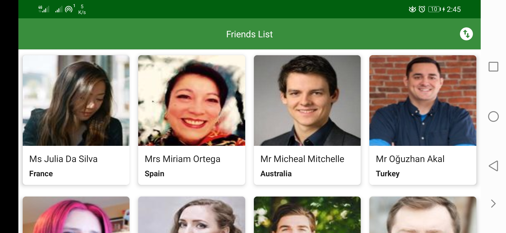

# Welcome to Friends

Welcome to **Friends.**
**Friends** is a native Android app for Android Responsive UI 
that fetches and displays a grid of 10 Users from https://randomuser.me.

# Specifications

1. Used Android Studio to create the project.
2. Target Sdk is Android 11.
3. Kotlin is used as code in to the app.
4. Follows MVVM architecture pattern.
5. Code maintains best practices & solid principle guideline.
6. Used standard Human Interface Guidelines to design the app.
7. App is work in Landscape mode too.
8. Added comments on Code where necessary.
9. Avoid third-party libraries but used some necessary e.g, Retrofit for Network call etc.

# External Libraries

1. **Lifecycle-aware components**, for automatically adjust their behavior based on the current lifecycle state.
2. **Retrofit**, for Network call
3. **RxJava**, for composing asynchronous and event-based programs by using observable sequences.
4. **Glide**, for image loading.

# Screenshots

