# Welcome to Friends

[](https://www.android.com)
[](https://www.apache.org/licenses/LICENSE-2.0.html)
[](https://docs.gradle.org/current/release-notes)
[](https://github.com/KotlinBy/awesome-kotlin)

Welcome to **Friends.**
**Friends** is a native Android app for Android Responsive UI 
that fetches and displays a grid of 10 Users from https://randomuser.me.

# Specifications
1. Used Android Studio to create the project.
2. Target Sdk is Android 11.
3. Kotlin is used as code in to the app.
4. Follows MVVM architecture pattern.
5. Code maintains best practices & solid principle guideline.
6. Used standard Human Interface Guidelines to design the app.
7. App is work in Landscape mode too.
8. Added comments on Code where necessary.
9. Avoid third-party libraries but used some necessary e.g, Retrofit for Network call etc.

# External Libraries
1. **Lifecycle-aware components**, for automatically adjust their behavior based on the current
   lifecycle state.
2. **Retrofit**, for Network call
3. **RxJava**, for composing asynchronous and event-based programs by using observable sequences.
4. **Glide**, for image loading.

# Demo App

<table style="width:100%">
  <tr>
    <th>Portrait Example 1: Splash</th>
    <th>Portrait Example 2: Friends List</th>
  </tr>
  <tr>
    <td></td>
    <td>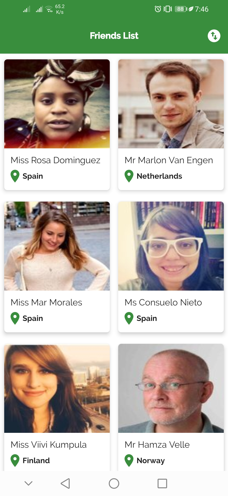</td>
  </tr>
  <tr>
    <th>Portrait Example 3: Friend Details (Portrait Expand)</th>
    <th>Portrait Example 4: Friend Details (Portrait Collapse)</th>
  </tr>
  <tr>
    <td>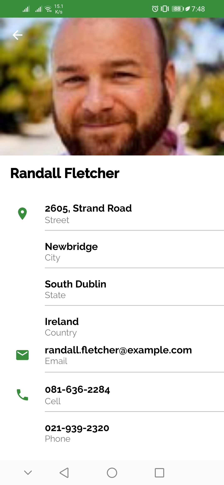</td>
    <td>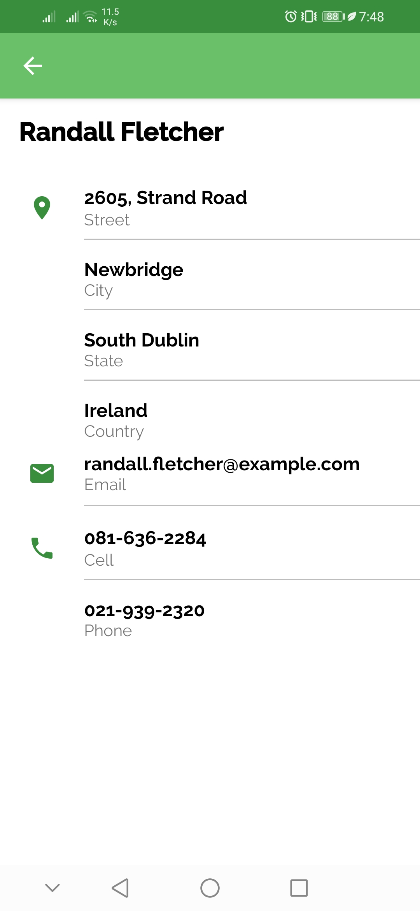</td>
  </tr>
  <tr>
    <th>Portrait Example 5: Friend Details (Portrait Expand): Arabic</th>
    <th>Portrait Example 6: Friend Details (Portrait Collapse): Arabic</th>
  </tr>
  <tr>
    <td></td>
    <td>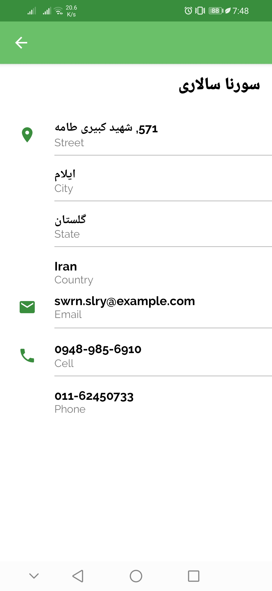</td>
  </tr>
  <tr>
    <th>Portrait Example 7: Send Mail</th>
    <th>Portrait Example 8: Compose Mail</th>
  </tr>
  <tr>
    <td>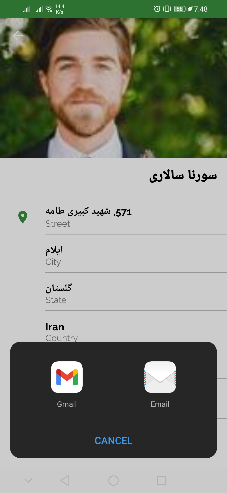</td>
    <td>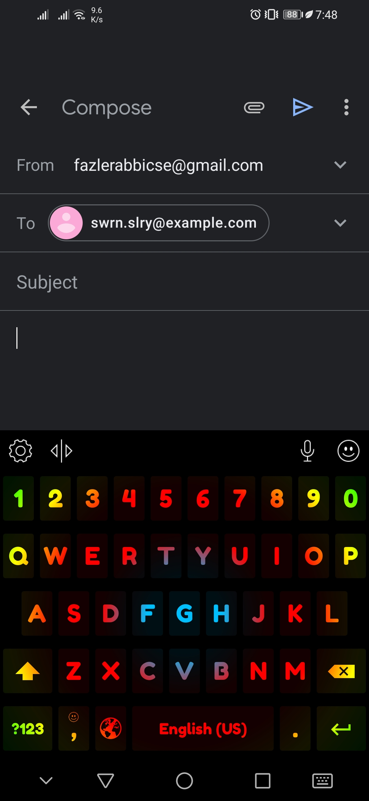</td>
  </tr>

  <tr>
    <th>Landscape Example 1: Splash</th>
    <th>Landscape Example 2: Friends List</th>
  </tr>
  <tr>
    <td>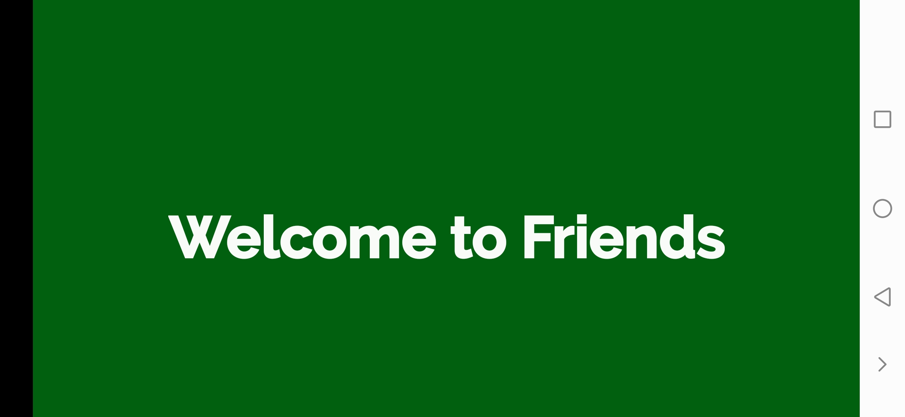</td>
    <td>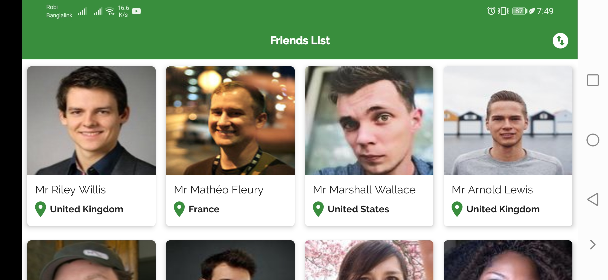</td>
  </tr>
  <tr>
    <th>Landscape Example 3: Friend Details (Portrait Expand)</th>
    <th>Landscape Example 4: Friend Details (Portrait Collapse)</th>
  </tr>
  <tr>
    <td>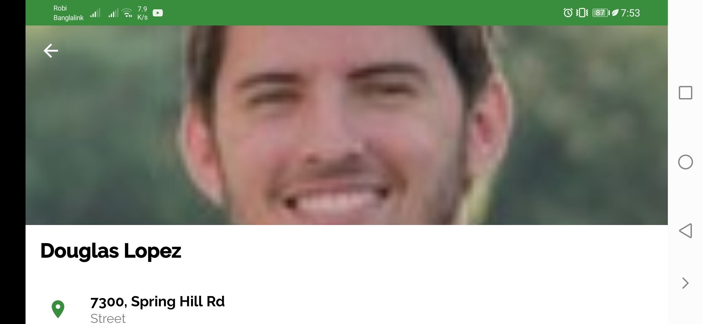</td>
    <td>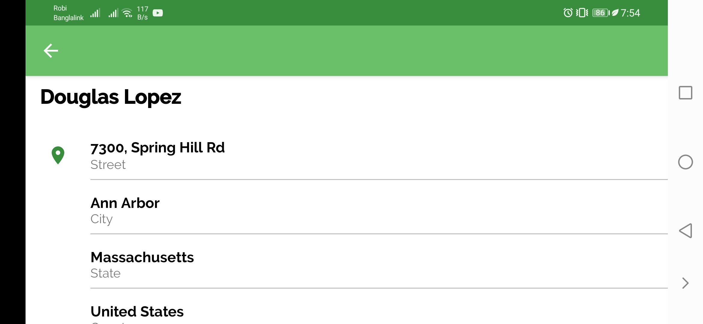</td>
  </tr>
  <tr>
    <th>Landscape Example 5: Friend Details (Portrait Collapse)</th>
    <th>Landscape Example 6: Send Mail</th>
  </tr>
  <tr>
    <td>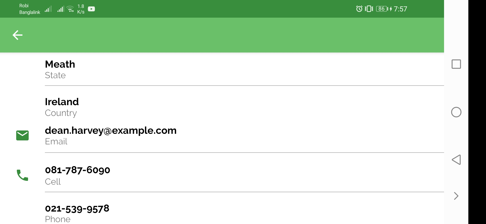</td>
    <td>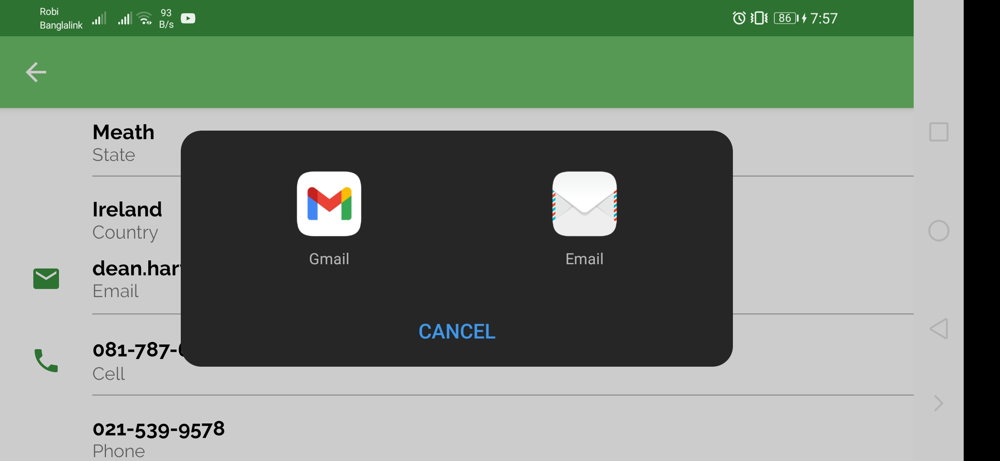</td>
  </tr>
  </table>

[comment]: <> (# Screenshots)

[comment]: <> ([comment]: <> &#40;<p align="center">&#41;)

[comment]: <> ([comment]: <> &#40;Mobile Screenshots &#40;Portrait&#41;&#41;)

[comment]: <> ([comment]: <> &#40;<p align="center">&#41;)

[comment]: <> ([comment]: <> &#40;&#41;)

[comment]: <> ([comment]: <> &#40;<p align="center">&#41;)

[comment]: <> ([comment]: <> &#40;&#41;)

[comment]: <> ([comment]: <> &#40;Mobile Screenshots &#40;Landscape&#41;&#41;)

[comment]: <> ([comment]: <> &#40;<p align="center">&#41;)

[comment]: <> ([comment]: <> &#40;&#41;)

[comment]: <> ()

[comment]: <> ()

[comment]: <> ()

# License

```
    Copyright (C) Fazle Rabbi

    Licensed under the Apache License, Version 2.0 (the "License");
    you may not use this file except in compliance with the License.
    You may obtain a copy of the License at

       http://www.apache.org/licenses/LICENSE-2.0

    Unless required by applicable law or agreed to in writing, software
    distributed under the License is distributed on an "AS IS" BASIS,
    WITHOUT WARRANTIES OR CONDITIONS OF ANY KIND, either express or implied.
    See the License for the specific language governing permissions and
    limitations under the License.
```